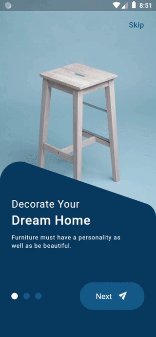

# flutter_ui_samples

UI examples built with Flutter.

<table style="padding:10px">
    <tr>
        <td>
            <a href="https://github.com/gzaber/flutter_ui_samples/tree/master/notes_app_ui">
                <b>notes_app_ui</b>
            </a>
        </td>
        <td>
            <a href="https://github.com/gzaber/flutter_ui_samples/tree/master/coffee_shop_app_ui">
                <b>coffee_shop_app_ui</b>
            </a>
        </td>
        <td>
            <a href="https://github.com/gzaber/flutter_ui_samples/tree/master/smartest_home_app_ui">
                <b>smartest_home_app_ui</b>
            </a>
        </td>
    </tr>
    <tr valign=top>
        <td>
            
        </td>
        <td>
            
        </td>
        <td>
            
        </td>
    </tr>
    <tr>
        <td>
            <a href="https://github.com/gzaber/flutter_ui_samples/tree/master/furniture_ecommerce_app_ui">
                <b>furniture_ecommerce_app_ui</b>
            </a>
        </td>
        <td>
            <a href="https://github.com/gzaber/flutter_ui_samples/tree/master/lamp_shop_app_ui">
                <b>lamp_shop_app_ui</b>
            </a>
        </td>
    </tr>
    <tr valign=top>
        <td>
            
        </td>
        <td>
            
        </td>
    </tr>
</table>
